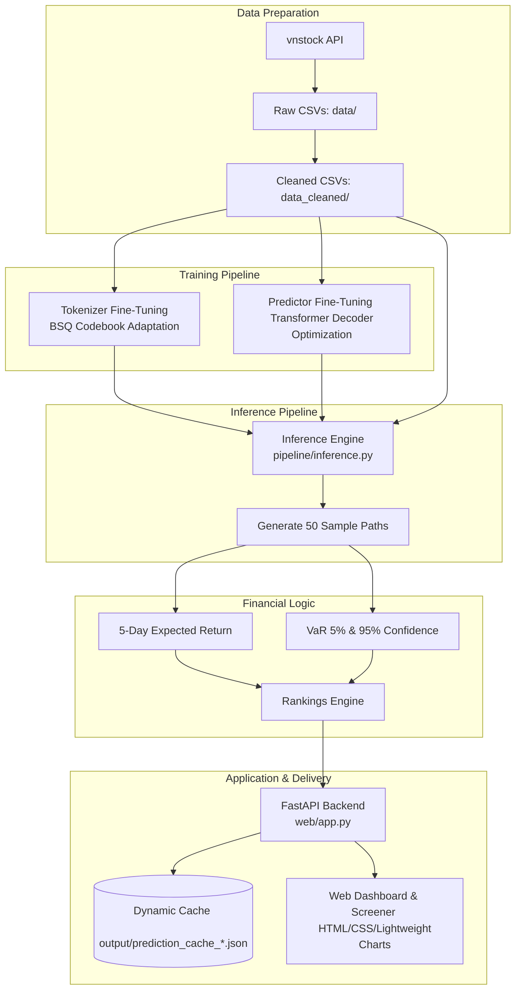

# Stock-VN-Forecasting

> Fine-tuning the Kronos time-series foundation model for Vietnamese stock market forecasting.

[English Version](./README.md) | [Bản Tiếng Việt](./README_VI.md)

---

## Introduction

This project implements a complete pipeline to adapt the **Kronos Financial Foundation Model** (AAAI 2026) to the Vietnamese stock market (VN50 basket). Kronos is originally pre-trained on over 12 billion financial price candles from 45 international stock exchanges. 

Adapting this foundation model to Vietnam's frontier/emerging market environment involves addressing unique regional dynamics, including a ±7% daily price limit (on HOSE), a T+2 settlement cycle, and trading activity dominated by retail investors. This repository focuses on fine-tuning the model's tokenizer (BSQ codebook) and predictor (decoder-only Transformer) to capture local market regimes while maintaining strict temporal splits to prevent look-ahead bias.

### Key Features

* **Sequential Fine-Tuning:** Tailored PyTorch scripts to fine-tune both the Tokenizer and the Predictor sequentially on Vietnamese stock price sequences.
* **Temporal Validation:** Walk-forward out-of-sample (OOS) testing configuration to guarantee robust performance evaluation without data leakage.
* **Real-time Inference & Business Logic:** Fast GPU/CPU batch inference execution mapped to customized financial metrics (Expected Return, VaR-based Risk Score, and Directional Trend).
* **Dynamic Cache Management:** Dynamic cache naming (`prediction_cache_YYYYMMDD.json`) aligned with the latest historical trading date, preventing overwrites and tracking history.
* **Interactive Dashboard:** Fast FastAPI-based web application with professional charts, interactive screener, and Explainable AI (XAI) token distribution views.

---

## System Architecture

The following block diagram represents the end-to-end flow of the system:



---

## Benchmarks & Evaluation

### Portfolio Backtest Performance
Comparison of cumulative returns for the Long-only portfolio between the baseline model and the fine-tuned version on out-of-sample testing:


### Tokenizer Reconstruction Quality
Convergence trends of the Binary Spherical Quantization (BSQ) codebook adaptation during tokenizer training:
| Tokenizer Losses | Tokenizer Metrics |
| :---: | :---: |
|  |  |

*The Median MAPE (MdAPE) for Volume and Amount is maintained under `3.2%`, preserving transaction liquidity characteristics.*

### Predictor Next-Token Performance
Next-token prediction training performance of the Decoder-only Transformer on VN50 stocks:
| Predictor Losses | Predictor Metrics |
| :---: | :---: |
|  |  |

---

## Installation

### Prerequisites
* Python 3.10 or higher
* CUDA-enabled GPU (Highly recommended for training/inference)

### Setup Steps
1. **Clone the Repository:**
   ```bash
   git clone https://github.com/vminh16/stock-VietNam-forecashing.git
   cd stock-VietNam-forecashing
   ```

2. **Create and Activate Environment (Conda recommended):**
   ```bash
   conda create -n stock python=3.10 -y
   conda activate stock
   ```

3. **Install Dependencies:**
   ```bash
   pip install -r requirements.txt
   pip install vnstock
   ```

---

## Usage

### 1. Collect Data
Download daily historical price data for VN50 stocks:
```bash
python finetune_csv/data/collect_data.py
```

### 2. Run Fine-Tuning
Execute the fine-tuning process sequentially:
```bash
# Fine-tune Tokenizer
python finetune_csv/finetune_tokenizer.py --config finetune_csv/configs/config_vn50.yaml

# Fine-tune Predictor
python finetune_csv/finetune_base_model.py --config finetune_csv/configs/config_vn50.yaml

# Run sequentially in one script
python finetune_csv/train_sequential.py --config finetune_csv/configs/config_vn50.yaml
```

### 3. Start Web Dashboard
Run the FastAPI application locally:
```bash
python web/run.py
```
Open **`http://localhost:7070`** in your browser.

---

## Project Structure

* [model/](file:///c:/Users/USER/Desktop/Stock-VN-forecashing/model) - Core neural network code for Kronos (BSQ, Transformer, Predictor) — *architecture frozen by design*.
* [pipeline/](file:///c:/Users/USER/Desktop/Stock-VN-forecashing/pipeline) - Isolated inference pipeline (PyTorch execution) configured via YAML.
* [web/](file:///c:/Users/USER/Desktop/Stock-VN-forecashing/web) - FastAPI backend, CSS styling, and Javascript dashboard charts.
* [output/](file:///c:/Users/USER/Desktop/Stock-VN-forecashing/output) - Directory for dynamically named cache files.
* [finetune_csv/](file:///c:/Users/USER/Desktop/Stock-VN-forecashing/finetune_csv) - Data collecting scripts, configs, and training execution files.
* [SPEC.md](file:///c:/Users/USER/Desktop/Stock-VN-forecashing/SPEC.md) - Deep-dive technical specifications and architectural constraints.

---

## Citation

```bibtex
@misc{shi2025kronos,
      title={Kronos: A Foundation Model for the Language of Financial Markets}, 
      author={Yu Shi and Zongliang Fu and Shuo Chen and Bohan Zhao and Wei Xu and Changshui Zhang and Jian Li},
      year={2025},
      eprint={2508.02739},
      archivePrefix={arXiv},
      primaryClass={q-fin.ST},
      url={https://arxiv.org/abs/2508.02739}, 
}
```

## License

This project is licensed under the MIT License — see [LICENSE](./LICENSE).
