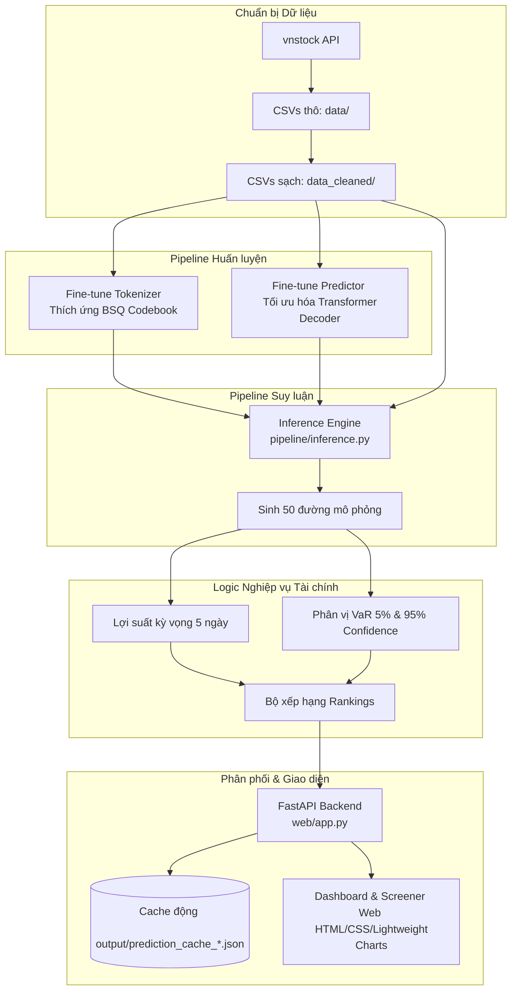
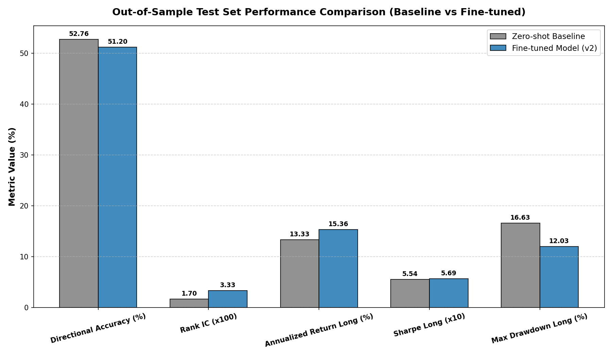
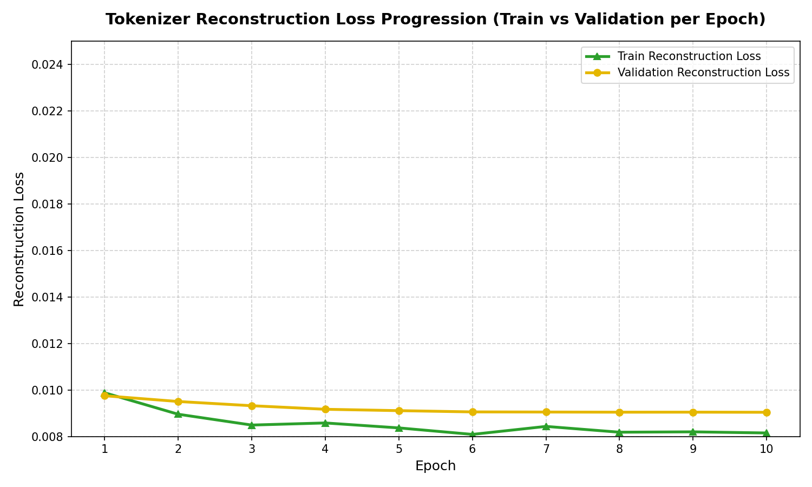
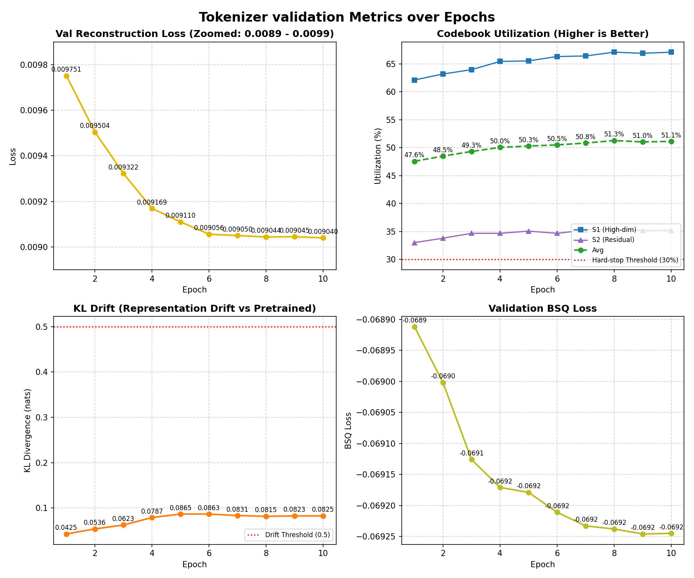
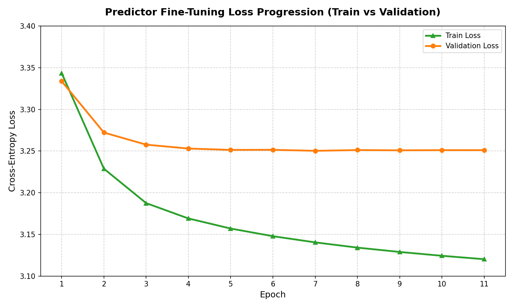
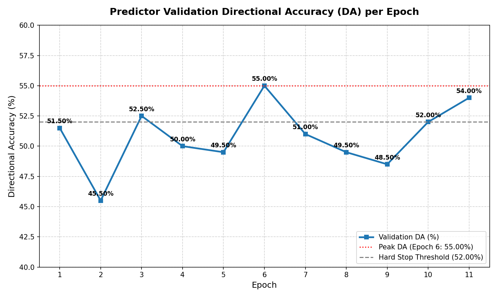

# Stock-VN-Forecasting

> Tinh chỉnh mô hình nền tảng chuỗi thời gian Kronos cho dự báo thị trường chứng khoán Việt Nam.

[English Version](./README.md) | [Bản Tiếng Việt](./README_VI.md)

---

## Giới thiệu dự án

Dự án này triển khai một pipeline hoàn chỉnh nhằm thích ứng hóa **Mô hình nền tảng tài chính Kronos** (AAAI 2026) cho rổ cổ phiếu VN50 tại thị trường chứng khoán Việt Nam. Mô hình Kronos gốc được huấn luyện trước trên hơn 12 tỷ nến giá tài chính từ 45 sàn giao dịch quốc tế lớn.

Việc chuyển giao học máy (transfer learning) của mô hình nền tảng sang môi trường thị trường cận biên/mới nổi của Việt Nam đòi hỏi giải quyết các đặc thù khu vực quan trọng, bao gồm biên độ dao động giá ngày ±7% (trên sàn HOSE), chu kỳ thanh toán T+2 và hành vi giao dịch chiếm ưu thế bởi các nhà đầu tư cá nhân. Dự án tập trung tối ưu hóa tầng tokenizer (BSQ codebook) và tầng predictor (decoder-only Transformer) để nắm bắt các đặc trưng vận động cục bộ của thị trường trong khi vẫn duy trì cấu trúc temporal split nghiêm ngặt nhằm tránh rò rỉ dữ liệu.

### Các tính năng cốt lõi

* **Pipeline tinh chỉnh tuần tự (Sequential Fine-Tuning):** Cung cấp các mã nguồn PyTorch tối ưu để huấn luyện tuần tự Tokenizer và Predictor trên dữ liệu giá chứng khoán Việt Nam.
* **Đánh giá kiểm thử phi trùng lặp (Temporal Validation):** Cấu hình kiểm tra walk-forward ngoài mẫu (OOS) không trùng lấp đảm bảo đánh giá hiệu quả thực tế và ngăn ngừa rò rỉ dữ liệu.
* **Suy luận thời gian thực & Logic nghiệp vụ:** Chạy suy luận batch song song tốc độ cao trên GPU/CPU, tự động tính toán các chỉ số tài chính nghiệp vụ (Lợi suất kỳ vọng, Điểm rủi ro dựa trên VaR và Phân loại xu hướng).
* **Quản lý Cache động:** Cơ chế đặt tên tệp cache tự động (`prediction_cache_YYYYMMDD.json`) dựa trên ngày giao dịch thực tế cuối cùng của nến lịch sử, giúp theo dõi lịch sử dự báo và tránh ghi đè dữ liệu.
* **Dashboard trực quan tương tác:** Ứng dụng web FastAPI tinh gọn tích hợp các biểu đồ phân tích kỹ thuật Lightweight Charts, bảng sàng lọc (Screener) và hiển thị phân phối tần suất token XAI.

---

## Kiến trúc hệ thống

Sơ đồ khối dưới đây mô tả luồng hoạt động khép kín từ dữ liệu lịch sử đến dự báo và giao diện người dùng:



---

## Kết quả thực nghiệm và Đánh giá

### Hiệu suất đầu tư danh mục (Backtest)
So sánh lợi suất lũy kế của chiến lược Long-only ngoài mẫu (OOS) giữa mô hình Kronos gốc và phiên bản đã tinh chỉnh:


### Chỉ số huấn luyện Tokenizer (Tokenizer Loss & Metrics)
Hội tụ của hàm loss và sai số phục dựng (MAPE) trong quá trình huấn luyện BSQ:
| Tokenizer Losses | Tokenizer Metrics |
| :---: | :---: |
|  |  |

*Sai số trung vị MAPE (MdAPE) cho khối lượng và giá trị giao dịch được duy trì ổn định dưới mức `3.2%`, bảo toàn tốt đặc trưng thanh khoản.*

### Chỉ số huấn luyện Predictor (Predictor Loss & Metrics)
Đồ thị biểu thị sai số huấn luyện và chỉ số độ chính xác của tầng Predictor trên 50 mã VN50:
| Predictor Losses | Predictor Metrics |
| :---: | :---: |
|  |  |

---

## Cài đặt

### Yêu cầu hệ thống
* Python 3.10 trở lên
* GPU hỗ trợ CUDA (Khuyến nghị để tăng tốc huấn luyện/suy luận)

### Các bước cài đặt
1. **Clone mã nguồn:**
   ```bash
   git clone https://github.com/vminh16/stock-VietNam-forecashing.git
   cd stock-VietNam-forecashing
   ```

2. **Khởi tạo và kích hoạt môi trường ảo (Khuyến nghị dùng Conda):**
   ```bash
   conda create -n stock python=3.10 -y
   conda activate stock
   ```

3. **Cài đặt các thư viện phụ thuộc:**
   ```bash
   pip install -r requirements.txt
   pip install vnstock
   ```

---

## Hướng dẫn chạy chương trình

### 1. Thu thập dữ liệu
Tải dữ liệu giá lịch sử ngày cho rổ VN50:
```bash
python finetune_csv/data/collect_data.py
```

### 2. Chạy huấn luyện (Fine-Tuning)
Thực hiện huấn luyện tuần tự các thành phần:
```bash
# Fine-tune Tokenizer
python finetune_csv/finetune_tokenizer.py --config finetune_csv/configs/config_vn50.yaml

# Fine-tune Predictor
python finetune_csv/finetune_base_model.py --config finetune_csv/configs/config_vn50.yaml

# Chạy tuần tự cả hai bước chỉ với một lệnh
python finetune_csv/train_sequential.py --config finetune_csv/configs/config_vn50.yaml
```

### 3. Khởi chạy Web Dashboard
Khởi động ứng dụng FastAPI:
```bash
python web/run.py
```
Truy cập địa chỉ **`http://localhost:7070`** trên trình duyệt của bạn.

---

## Cấu trúc thư mục dự án

* [model/](file:///c:/Users/USER/Desktop/Stock-VN-forecashing/model) - Mã nguồn kiến trúc mạng thần kinh Kronos (BSQ, Transformer, Predictor) — *được đóng băng mặc định*.
* [pipeline/](file:///c:/Users/USER/Desktop/Stock-VN-forecashing/pipeline) - Module suy luận độc lập (PyTorch) cấu hình linh hoạt bằng tệp YAML.
* [web/](file:///c:/Users/USER/Desktop/Stock-VN-forecashing/web) - Backend FastAPI và giao diện hiển thị biểu đồ Lightweight Charts.
* [output/](file:///c:/Users/USER/Desktop/Stock-VN-forecashing/output) - Thư mục lưu trữ các tệp cache dự báo động.
* [finetune_csv/](file:///c:/Users/USER/Desktop/Stock-VN-forecashing/finetune_csv) - Mã nguồn cào dữ liệu, cấu hình YAML và kịch bản huấn luyện mô hình.
* [SPEC.md](file:///c:/Users/USER/Desktop/Stock-VN-forecashing/SPEC.md) - Đặc tả chi tiết các quyết định thiết kế và giới hạn hệ thống.

---

## Trích dẫn (Citation)

```bibtex
@misc{shi2025kronos,
      title={Kronos: A Foundation Model for the Language of Financial Markets}, 
      author={Yu Shi and Zongliang Fu and Shuo Chen and Bohan Zhao and Wei Xu and Changshui Zhang and Jian Li},
      year={2025},
      eprint={2508.02739},
      archivePrefix={arXiv},
      primaryClass={q-fin.ST},
      url={https://arxiv.org/abs/2508.02739}, 
}
```

## Giấy phép (License)

Mã nguồn dự án được phát hành theo giấy phép MIT License — xem [LICENSE](./LICENSE).
